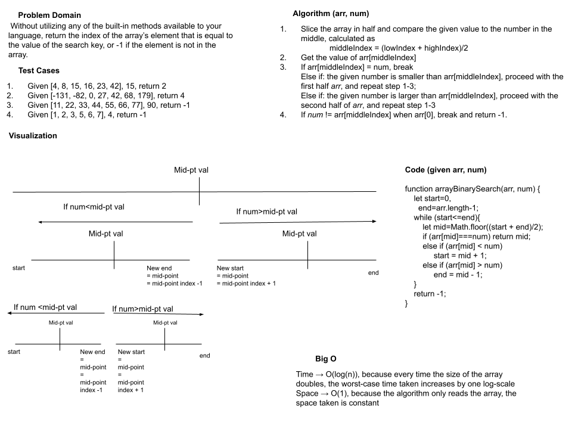

# Reverse Array

 Without utilizing any of the built-in methods available to your language, return the index of the array’s element that is equal to the value of the search key, or -1 if the element is not in the array.

## Whiteboard Process

## Approach & Efficiency

Time → O(log(n)), because every time the size of the array doubles, the worst-case time taken increases by one log-scale
Space → O(1), because the algorithm only reads the array, the space taken is constant

## Solution

function arrayBinarySearch(arr, num) {\
    let start=0,\
      end=arr.length-1;\
    while (start<=end){\
        let mid=Math.floor((start + end)/2);\
        if (arr[mid]===num) return mid;\
        else if (arr[mid] < num)\
             start = mid + 1;\
        else if (arr[mid] > num)\
             end = mid - 1;\
    }\
    return -1;\
}\

