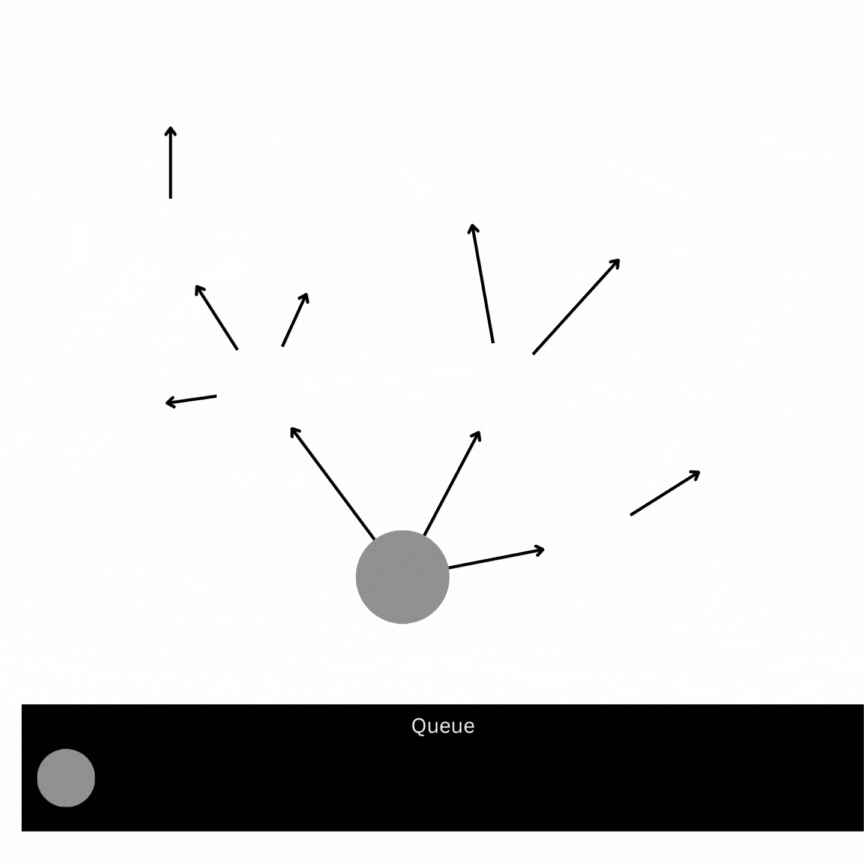

# Graphs

This is a simple implementation of the Breadth-First Graph Traversal algorithm using Node.js. The algorithm allows you to traverse a graph in a breadth-first manner, visiting all the nodes at each level before moving on to the next level. This approach ensures that nodes closer to the starting node are visited first.

## UML

## Algorithm Explanation

The Breadth-First Graph Traversal algorithm can be summarized as follows:

1. Create a queue data structure to store the nodes to be visited.
2. Enqueue the starting node into the queue.
3. Create a set to keep track of visited nodes.
4. While the queue is not empty:

- Dequeue a node from the queue (array.shift())
- Push the node to the array to be returned

5. Enqueue all unvisited neighboring nodes into the queue.
6. Mark the current node as visited.
7. Repeat steps 4 until the queue is empty.
