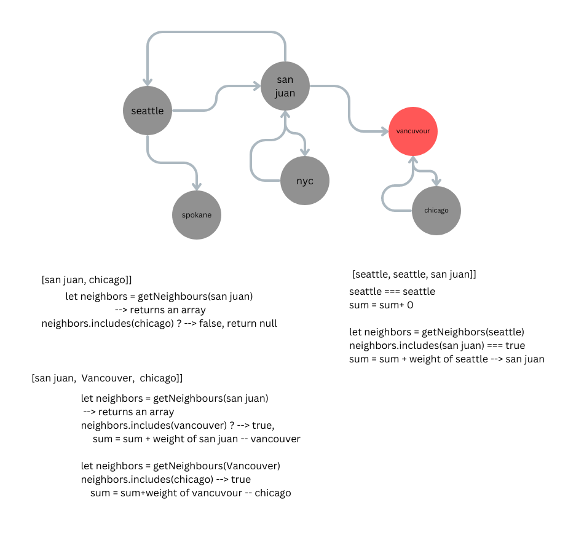

# Calculating Total Cost using Graph Traversal

This is a project that demonstrates how to calculate the total cost by performing graph traversal. The algorithm enables you to traverse a graph and accumulate costs associated with each edge or node. This can be useful in various scenarios, such as calculating the total cost of a path in a transportation network or finding the minimum cost path in a weighted graph.

## UML

## Algorithm Explanation

The funciton in this algorithm takes in two arguements:

- cityGraph: graph consists of cities and cost to travel between cities
- cityArr: an array consists of cities the forms a potential route

The algorithm for calculating the total cost using graph traversal can be summarized as follows:

1. Start from cityArray[0], get the neighbors of the node
2. If the following city is a neighbor of the current city, add the weight from cityArray[0] to cityArray[1]. Repeat for the next city in the given array
3. If the following city is not a neighbor of the current city, set sum = 0, return the sum
