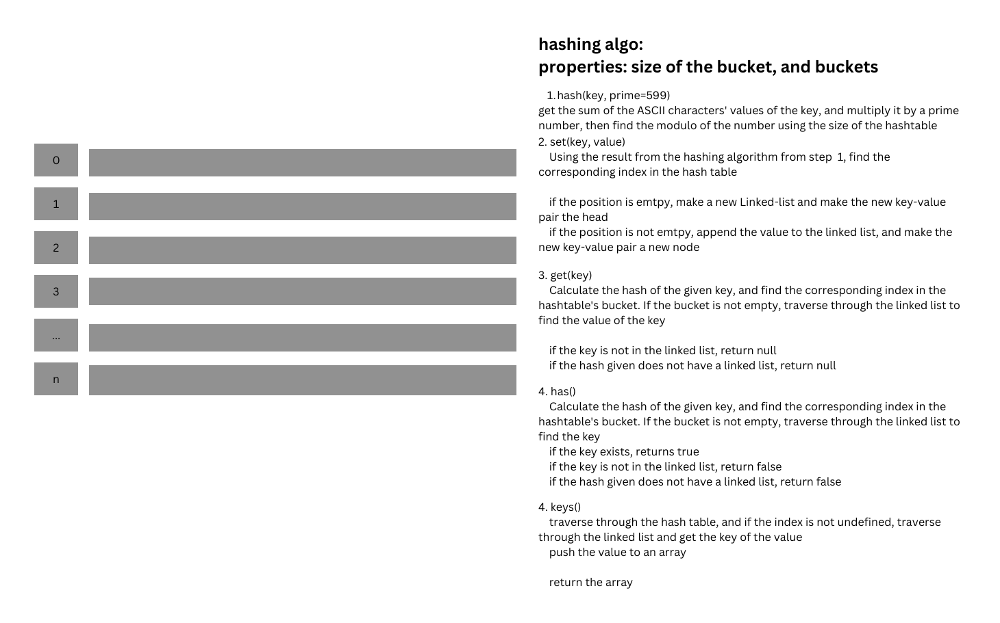

# Hash Table Implementation
<!-- Description of the challenge -->

## Whiteboard Process

## Approach & Efficiency

`set()`
Time: O(1), regardless of the size of the table, the process to set the key-value pair is the same
Space: O(1), regardless of the size of the table, the space required to set the key-value pair is the same

`get()`:
Time: O(n), the worst case runtime would be the size of the entire hashtable
Space: O(1), regardless of the size of the table, the space required to set the key-value pair is the same

`keys()`:
Time: O(n), the worst case runtime would be the size of the entire hashtable
Space: O(n), space required would increase as the value stored in the hastable increases

`has()`:
Time: O(n), the worst case runtime would be the size of the entire hashtable
Space: O(n), space required would increase as the value stored in the hastable increases
