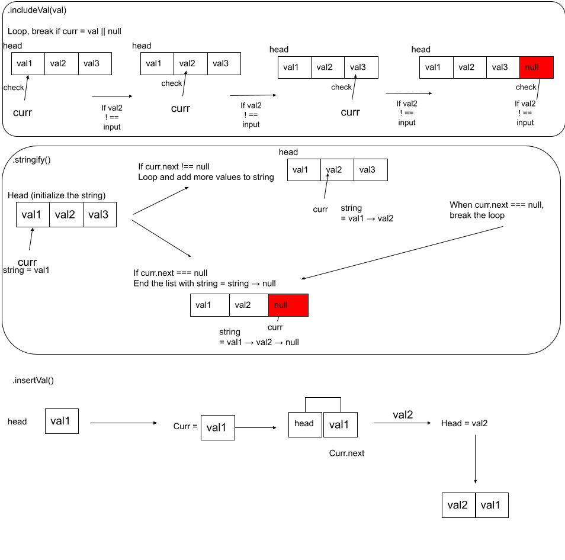

# Linked List

An empty linked list will be built once the class is instantiated, methods available within the class:

`.insertVal()`: insert a value to the head of the linked list

- accepts any datatype as an arguement

`.includeVal()`: returns if the given value is in the linked list, returns boolean

`.toString()`: returns a string of all values in the linked list

`kthFromEnd(k)`: returns the value of index counting from tail.

- if k<0 or k>linked-list.length, a message will be displayed shoing the input is out-of-bounds

## Whiteboard Process
<!-- Embedded whiteboard image -->
Whiteboard for Linked List

Whiteboard for LinkedList Insertion

## Approach & Efficiency

Time: O(n), the worst runtime would be the lenggh from the first node to the last node;
Space: O(1), regardless of how the list grows, it will use the same resources

## Solution

[label](linked-list.js)
