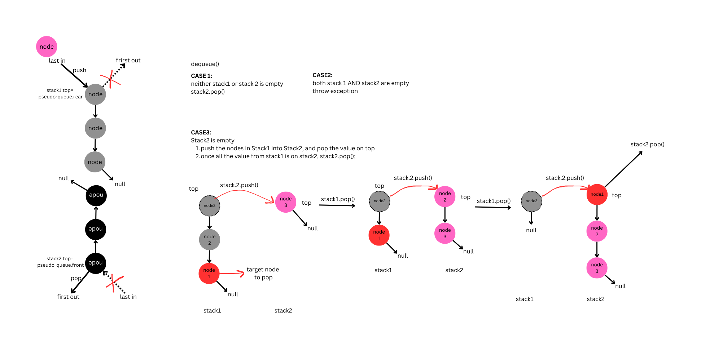

# Linked List

## Table of Contents

## Linked List Methods

An empty linked list will be built once the class is instantiated, methods available within the class:

`.insertVal()`: insert a value to the head of the linked list

- accepts any datatype as an arguement

`.includeVal()`: returns if the given value is in the linked list, returns boolean

`.toString()`: returns a string of all values in the linked list

`kthFromEnd(k)`: returns the value of index counting from tail.

- if k<0 or k>linked-list.length, a message will be displayed shoing the input is out-of-bounds

`zipLists(list1, list2)`: returns a new linked list with alternating values from list1 and list2

- takes in two linked list as arguements

## Stack Methods

`push(value)`: pushes the given value as a new node to the top of the stack, returns the stack with the new value added

`pop()`: pops off the value on top of the stack, returns the value of Node being popped off

`isEmpty()`: returns a Boolean, true if the stack has a length of 0, and false if the stack has a length > 0;

- an exception will be raised if the stack is empty

`peak()`: returns the value of the Node on the top of the stack

- an exception will be raised if the stack is empty

## Queue Methods

`enqueue(value)`: adds a new Node to the back of the queue, returns the new queue

`dequeue()`: removes the node in the front of the queue, returns the value of the node being removed;

`isEmpty()`: returns a Boolean, true if the queue has a length of 0, and false if the queue has a length > 0;

- an exception will be raised if the queue is empty

`peak()`: returns the value of the node in the front of the queue

- an exception will be raised if the queue is empty

## Pseudo-Queue Methods

`enqueue(value)`: adds a new Node to the rear Stack of the queue

`dequeue()`: removes a node in the front Stack of the queue;

## Whiteboard Process (Linked Lists)
<!-- Embedded image -->
Whiteboard for Linked List

Whiteboard for LinkedList Insertion

Whiteboard for zipped Linkedlist

## Whiteboard Process (Stacks and Queues)

## Whiteboard Process (Pseudo-Queue)

## Approach & Efficiency

**Linked-Lists**

`.insertVal()`: insert a value to the head of the linked list

- Time: O(1), the time is constant regardless of how long the linked list is;
- Space: O(1), regardless of how the list grows, it will use the same resources

`.includeVal()`: returns if the given value is in the linked list, returns boolean

- Time: O(n), the worst runtime would be the lenggh from the first node to the last node, so it grows as the list grows
- Space: O(n), the worst runtime would be the length from the first node to the last node, so it grows as the list grows

`.toString()`: returns a string of all values in the linked list

- Time: O(n), the worst runtime would be the lenggh from the first node to the last node, so it grows as the list grows
- Space: O(n), the worst runtime would be the length from the first node to the last node, so it grows as the list grows

`kthFromEnd(k)`: returns the value of index counting from tail.

- Time: O(n), the worst runtime would be the lenggh from the first node to the last node, so it grows as the list grows
- Space: O(n), the worst runtime would be the length from the first node to the last node, so it grows as the list grows

`zipLists(list1, list2)`: returns a new linked list with alternating values from list1 and list2

- Time: O(n), the worst runtime would be the lenggh from the first node to the last node, so it grows as the list grows
- Space: O(n), the worst runtime would be the length from the first node to the last node, so it grows as the list grows

**Stacks**

`push(value)`: pushes the given value as a new node to the top of the stack, returns the stack with the new value added

- Time: O(1), the runtime will be constant since it only pushes a value to the top of the stack regardless regardless of the size of the stack
- Space: O(1), the resource will be constant since it only pushes a value to the top of the stack regardless regardless of the size of the stack

`pop()`: pops off the value on top of the stack, returns the value of Node being popped off

- Time: O(1), the runtime will be constant since it only pops off a value to the top of the stack regardless regardless of the size of the stack
- Space: O(1), the resource will be constant since it only pops off a value to the top of the stack regardless regardless of the size of the stack

`isEmpty()`: returns a Boolean, true if the stack has a length of 0, and false if the stack has a length > 0;

- Time: O(1), the runtime will be constant it only needs to check the `length` property of the stack
- Space: O(1), the resrouces required will be constant it only needs to check the `length` property of the stack

`peak()`: returns the value of the Node on the top of the stack

- Time: O(1), the runtime will be constant since it only checks the value of the node on top, regardless regardless of the size of the stack
- Space: O(1), the resource will be constant since it only checks the value of the node on top, regardless regardless of the size of the stack

**Queue**

`enqueue(value)`: adds a new Node to the back of the queue, returns the new queue

- Time: O(1), the runtime will be constant since it only pushes a value to the back of the queue regardless regardless of the size of the queue
- Space: O(1), the resource will be constant since it only pushes a value to the front of the queue regardless regardless of the size of the queue

`dequeue()`: removes the node in the front of the queue, returns the value of the node being removed

- Time: O(1), the runtime will be constant since it only pops off a value to the back of the queue regardless regardless of the size of the queue
- Space: O(1), the resource will be constant since it only pops off a value to the front of the queue regardless regardless of the size of the queue

`isEmpty()`: returns a Boolean, true if the queue has a length of 0, and false if the queue has a length > 0;

- Time: O(1), the runtime will be constant it only needs to check the `length` property of the queue
- Space: O(1), the resrouces required will be constant it only needs to check the `length` property of the queue

`peak()`: returns the value of the node in the front of the queue

- Time: O(1), the runtime will be constant since it only checks the value of the node in the front, regardless regardless of the size of the queue
- Space: O(1), the resource will be constant since it only checks the value of the node in the front, regardless regardless of the size of the queue

**Pseudo-Queue**

`enqueue(value)`: adds a new value to the top of the stack in the back

- Time: O(1), the runtime will be constant since it only pushes a value to the back of the queue, which is top of the rear-stack, regardless regardless of the size of the queue or neither size of the stacks it's consisted of;
- Space: O(1), the resource will be constant since it only pushes a value to the rear stack's top regardless regardless of the size of the queue

`dequeue()`: removes the node in the front of the queue, returns the value of the node being removed

- Time:
**Case 1**: when neither stack given is empty
Time: O(1), the runtime will be constant since it only pops off a value from top of the front-stack of the queue, regardless regardless of the size of the queue
Space: O(1), the resource will be constant since it only pops off a value to the front stack of the queue regardless regardless of the size of the queue

**Case 2**: when both stacks are emtpy
Time: O(1), the runtime will be constant it only needs to check the length of the pseudo-queue
Space: O(1), the resource will be constant since it only needs to check the length of the pseudo-queue

**Case 3**: when only stack2 is empty
Time: O(n), the runtime will depend on the size of stack on (the rear stack), since it needs to iteratively transfer each node to stack2(the front stack). So the time will increase as the size of stack1 increases
Space: O(1), the resource will be constant since no new queue is made

## Solution

[linked-lists](linked-list.js)
[zip-linked-lists](zip-list.js)
[stack](stack.js)
[queue](queue.js)
