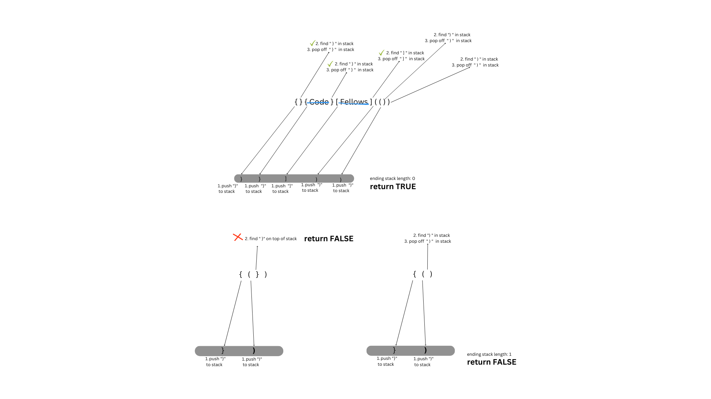

# Stack Queue Bracket

Using a stack to determine if a given string has corresponding opening/closing brackets in the correct order.

## UML/Whiteboard

## Algorithm

1. Make an object using the opening bracket as the key and closing bracket as the value
2. Iterate through each character in the given string. If the string mathes any of the keys in the object, push the value of the key to the stack
3. If the string character mathes any of the closing bracket, compare it with the value on the top of the stack

- if they match, pop off the node and continue the iteration
- if they don't match, return FALSE

4. Once all the characters are iterated through, check if the stack is empty

- if the stack is empty, return true
- if the stack have any left over values, return false

## Big O

Time: O(n): as the string size increases, the time taken to iterate through each string will increase
Space: O(n): as the string size increases, potentially the longer the stack will have to be to store all the unmatched closing brackets
