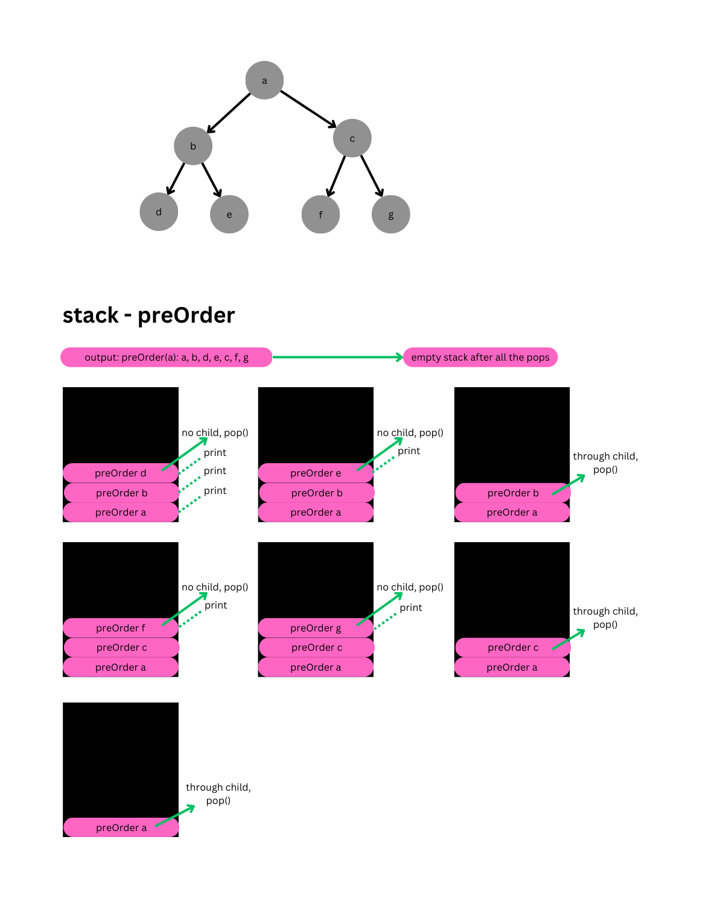
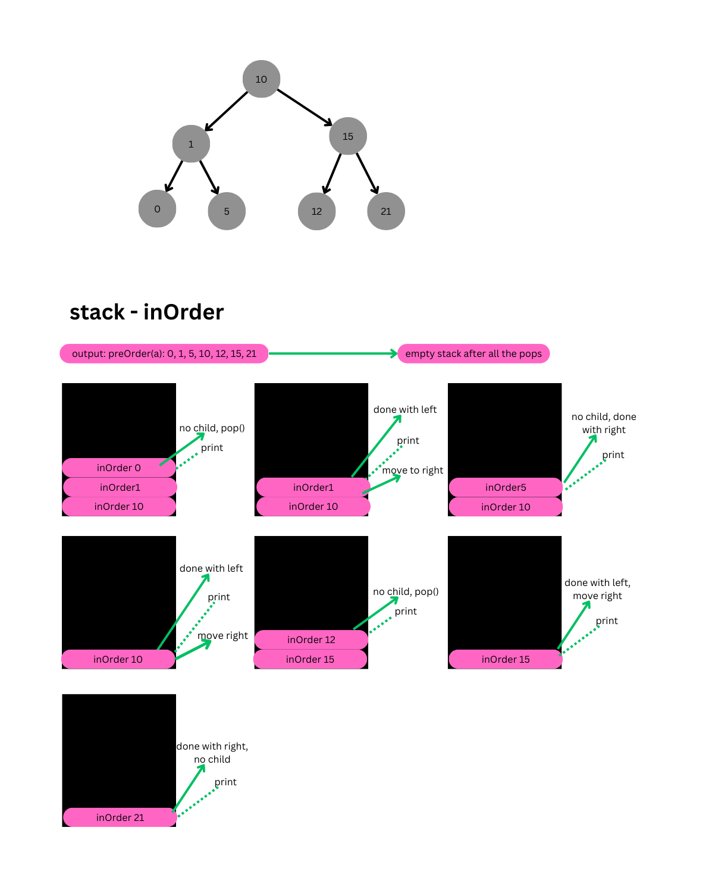
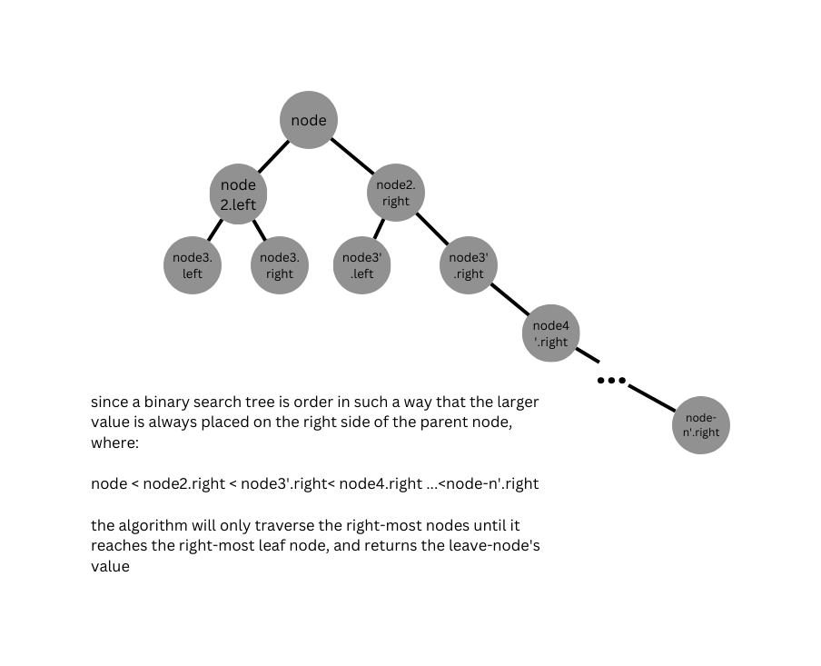

# Binary Trees

## UML

### Methods

#### Binary Tree Methods

- `pre-order()`: traverse a binary tree in the following order: parent --> left --> right
- `in-order()`: traverse a binary tree in the following order: left --> parent --> right
- `post-order()`: traverse a binary tree in the following order: parent --> right --> right

#### Binary Search Tree Methods

- `contains(value, node = this.root)`: returns a boolean, `true` if the tree contains the the `value`, `false` if the tree does not contain the value. The default value of the root will be the root node
- `find(value, node=this.root)`: returns the node that contains the `value`. The default starting point will be the root node unless otherwise specified
- `add(value)`: returns the tree after the value is added;

- `max(node=this.root)`: returns the largest value of the tree starting from a given node (optional), if specified. If no node is given, the method will start at the root and keep on moving on to the right child of the node until it reaches the right-most leaf.

### BigO

- Time: O(n), the worst-case runtime will increase linearly for every additional node;
- Space: O(n), the worst-case resources required will increase linearly for every additional node;
